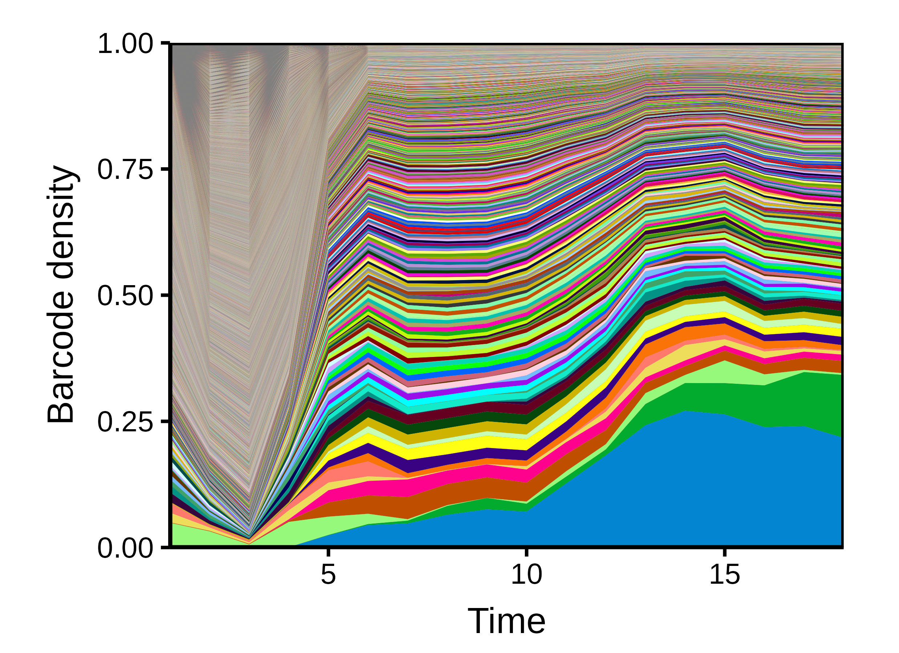
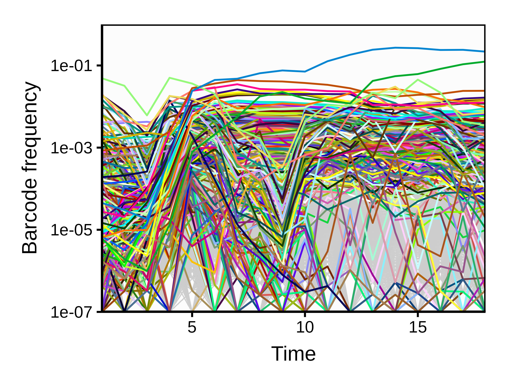
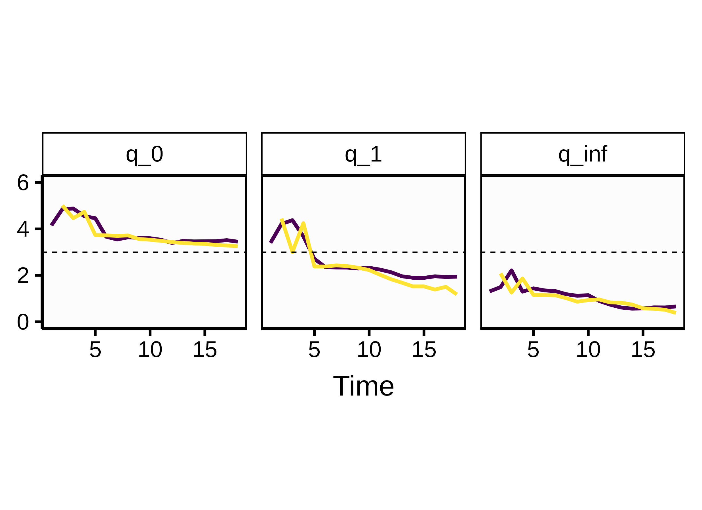
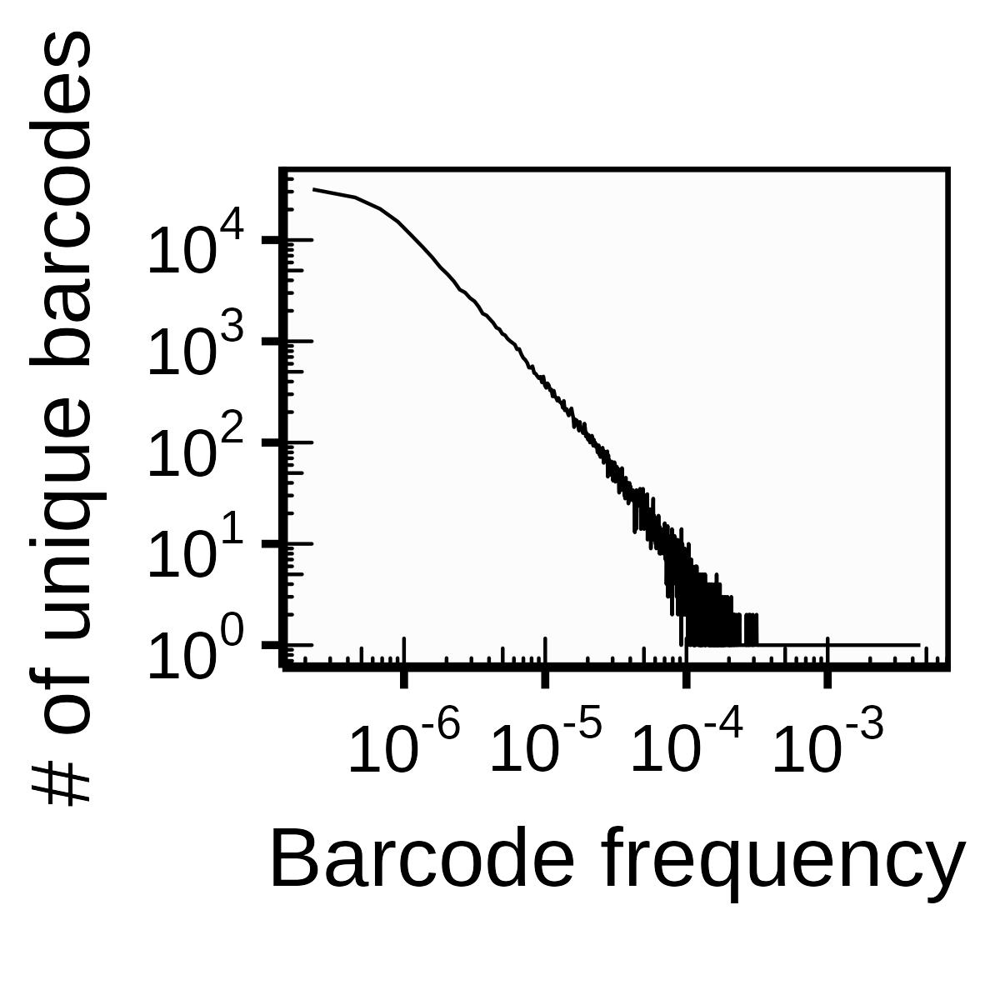
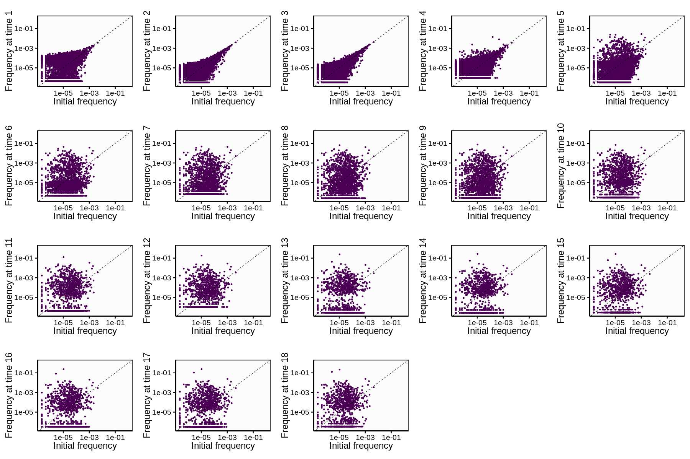
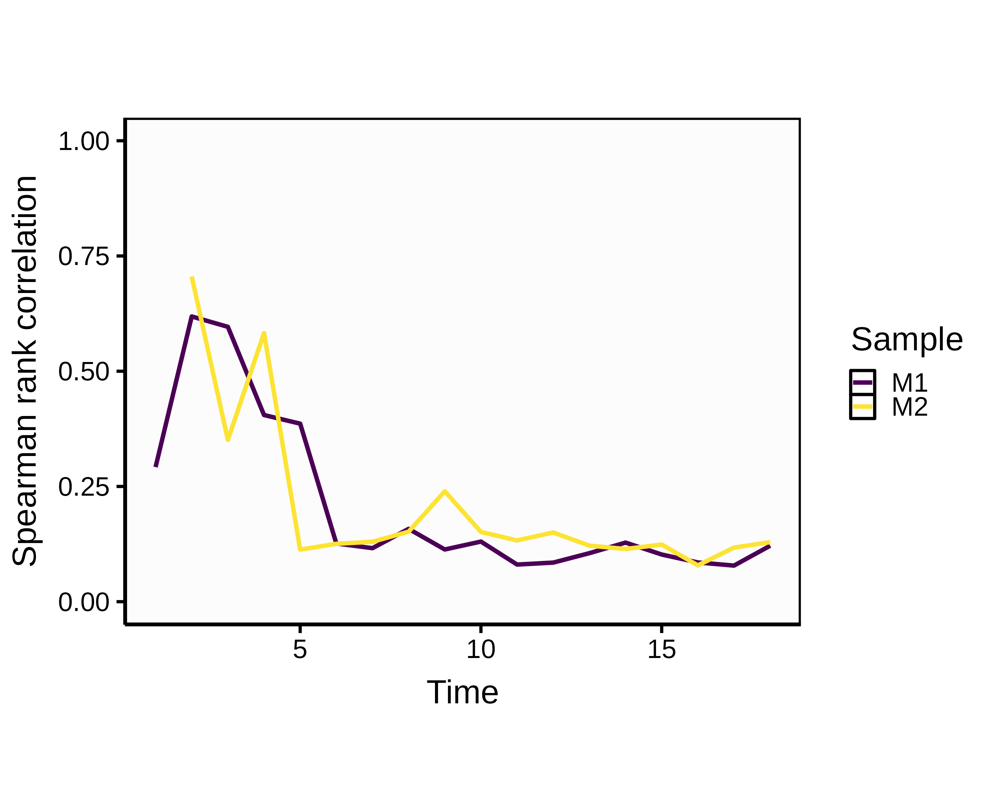
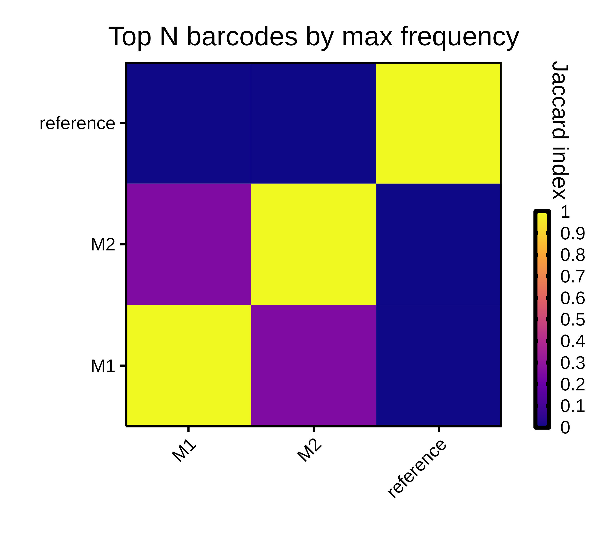
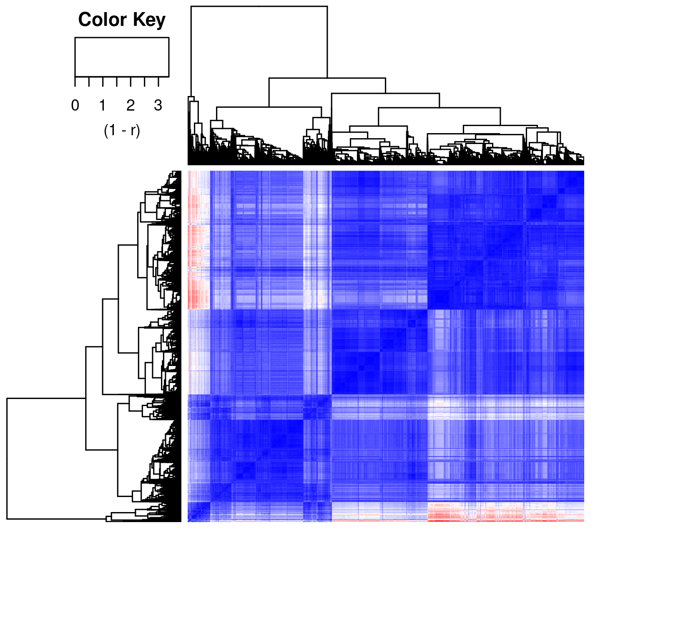
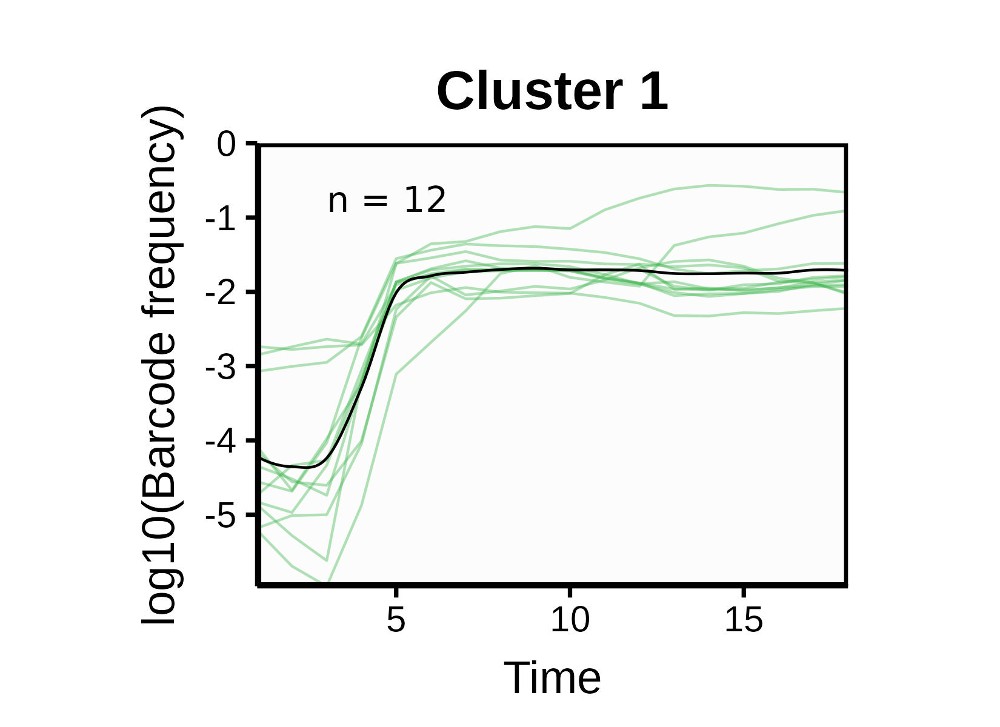
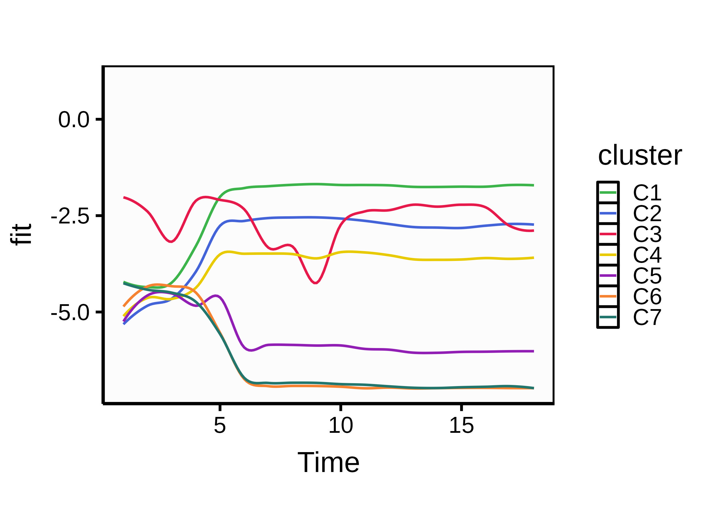

```{r, include = FALSE}

knitr::opts_knit$set(
              self.contained = TRUE)
knitr::opts_chunk$set(
  #collapse = TRUE,
  dpi = 55,
  fig.retina = 1,
  comment = "#>"
  )
  
```

## Table of Contents

### [1. *doblin* Package](#doblin-package-1)

\hspace{0.5cm}

[1.1 Barcode extraction from the FASTQ/FASTA file]

\hspace{0.5cm}

[1.2 Dependencies]

\hspace{0.5cm}

[1.3 Parsing arguments from the command line]

### [2. The pipeline](#the-pipeline-1)

\hspace{0.5cm}

[2.1 Data preparation]

\hspace{0.5cm}

[2.2 Visualizing barcode dynamics]

\hspace{0.5cm}

[2.3 Quantification of barcode diversity]

\hspace{0.5cm}

[2.4 Correlation between dataset and initial barcode library]

\hspace{0.5cm}

[2.5 Barcode lineage clustering]

\pagebreak

## 1. *doblin* Package {#doblin-package-1}

The *doblin* package is intended to be a comprehensive toolbox to understand how clonal populations of cells evolve over time. It was developed for the analysis of dominant and persistent barcode lineage data resulting from *Next Generation Sequencing* (NGS). In combination with functionalities needed for data analysis, the package offers a variety of visualizations.

In order to carry out an analysis, the barcodes must first be extracted from the sequencing data and grouped according to their respective sequences for each time point. This allows us to plot the frequency trajectory of each barcode. 

Since the objective is to highlight the dominant and persistent barcodes, we filter the data in order to keep only the barcodes associated with lineages having reached a certain minimum frequency and having survived a pre-defined period.

At this point, we assume that barcode lineages with similar population dynamics originate from the same ancestor, in which case we consider them as clones and gather them under a same cluster. To quantify the similarity between pairs of barcode lineages, we use a distance metric based either on the Pearson correlation or the Dynamic Time Warping (DTW). The resulting distance matrix is used to perform a hierarchical clustering of the barcode lineages.  An optimal clustering is a clustering that avoids grouping clonal lineages with distinct dynamics, but limits its groupings so that they are differentiable from each other. 

The final dynamics, representing the major clonal lineages, are obtained by computing a LOESS curve for each of the resulting clusters.

N.B.: All the presented code in the following pages come from the main.R script in the demo/ directory of the doblin package.

## 1.1 Barcode extraction from the FASTQ/FASTA file

This subsection is specifically for users with sequencing data who haven't yet perform barcode extraction. Prior to analysis, the user must identify and extract the barcode sequences from his raw sequencing data. *Bartender* is a useful tool to process barcode data (\underline{https://github.com/LaoZZZZZ/bartender-1.1}).

Once the barcodes have been extracted, it is primordial to format the data as follows:

```{=tex}
\begin{itemize}
\item Input file format: a csv file containing the barcode extraction results over \textbf{3 columns}: ID, Time, Reads.
\begin{description}
\item[ID:] consensus sequence that identifies a group of barcodes.

\item[Time:] integer representing the time at which the data was measured. If the input file contains time points starting at t=0, please extract them to a separate file. This newly created file requires the same format as the input file i.e. with 3 columns: ID, Time, Reads. It will be used as an initial barcode library. If the user doesn't have an initial barcode library, the time points should at least start at t=1.

\item[Reads:] number of barcodes that were counted at a certain time for a certain consensus sequence.
\end{description}
\end{itemize}
```
\pagebreak
## 1.2 Dependencies

If the necessary packages aren't already installed on your system, please install them before running the following pipeline.

```{r eval=FALSE, collapse=TRUE}
  list.of.packages <- c("grid", "ggthemes", "ggplot2", "magrittr", "dplyr",
                        "ggnewscale", "readr", "data.table", "reshape2",
                        "grDevices", "doblin", "optparse", "egg", "ggpubr",
                        "stats", "imputeTS", "data.table", "dtwclust",
                        "purrr", "tidyr", "TSdist")
  new.packages <- list.of.packages[!(list.of.packages 
                                     %in% installed.packages()[,"Package"])]
  if(length(new.packages)) install.packages(new.packages)

```

After loading the package with the `library("doblin")` command, the entire functionality of the package can be accessed.

\pagebreak

## 1.3 Parsing arguments from the command line

N.B.: Before running the command line, make sure to set your working directory to the `doblin` folder.

In order to use the following pipeline, a command line of the following form must be written:

`Rscript ./demo/main.R -x 1000 -t 0.0005 -o {output_directory} -s {sample_name} -i {input_file} -c {time_threshold}`

Example using 2 samples (M1 and M2):

`Rscript ./demo/main.R -x 1000 -t 0.0005 -o ~/Documents/ -s M1,M2 -i ./demo/M1_input.csv,./demo/M2_input.csv -c 14`

```{r eval=FALSE, collapse=TRUE}
library(doblin)
library(optparse)

options <- list(
  make_option(c("-x", "--intersection"), action = "store", type="integer",
              default=1000, help="Number of top barcodes to fetch [default
              %default]"),
  make_option(c("-t", "--treshold"), action = "store", type="double",
              default=0.0005, help="Limit frequency above which barcodes
              have assigned colors [default %default]"),
  make_option(c("-o", "--outputPath"), action = "store", type="character",
              default=getwd(), help="Output directory [default %default]"),
  make_option(c("-s", "--sampleNames"), action = "store", type="character",
              help="Sample's name or ID. If multiple: use comma to
              separate"),
  make_option(c("-i", "--inputFiles"), action = "store", type="character",
              help="Input csv file . If multiple: use comma to separate"),
  make_option(c("-c", "--timeCut"), action = "store", type="integer",
              help="Time point threshold (keep barcodes with at least x
              non-zero time points)")
)
arguments <- parse_args(OptionParser(option_list = options))

if (length(arguments)>= 7) {

  print("Processing the command line...")

  n_intersect = as.numeric(arguments$intersection)
  max_freq_treshold= as.double(arguments$treshold)
  output_directory = arguments$outputPath
  cohort_names = as.list(strsplit(arguments$sampleNames, ",")[[1]])
  input_files = as.list(strsplit(arguments$inputFiles, ",")[[1]])
  time_threshold = as.numeric(arguments$timeCut)

} else {

  stop("Missing arguments. Arguments must be supplied!", call.=FALSE)
}
```

If the user wants to go threw main.R manually, the parsing steps can be skipped. However, the user will have to define all 6 variables himself.

\pagebreak

## 2. The pipeline {#the-pipeline-1}

## 2.1 Data preparation

```{r eval=FALSE, collapse=TRUE}
## Step 0: Processing csv file(s)
print("Processing CSV files...")
input_data <- lapply(input_files, readr::read_csv)
```

As described earlier, the given input is a long-data format with ID, Time and Reads columns. After processing the input, we reshape it into a long-format dataframe in order to highlight the initial, final, mean and maximum frequencies of each barcode. This allows us to retrieve the dominant barcodes. We fetch the top N - where N is the `-x` argument given by the user (default: 1000) - barcodes of each sample according to their final and maximum frequencies.

```{r eval=FALSE, collapse=TRUE}
## Step 1: Reshape input files into dataframes
print("Reshaping input files into dataframes...")
dataframes <- lapply(input_data, reshapeDF)

```

```{r eval=FALSE, collapse=TRUE}
## Step 2: Fetch the top N barcodes of each dataframe
print("Fetching the top N barcodes of each dataframe...")
top_final <- list()
top_max <- list()
x <- lapply(dataframes, fetchTop, n_intersect)
for(element in x){
  top_final <-append(top_final, element[1])
  top_max <- append(top_max, element[2])
}
```

\pagebreak

## 2.2 Visualizing barcode dynamics

To compare barcode trajectories within and between samples, we aimed to use consistent color coding for barcode lineages. First, we assigned a unique color to all lineages that reached a relative frequency - specified by the `-t` argument in the command line (default: 0.0005). For example, a barcode lineage that was assigned the color "magenta [#c20078]" will always have this color in all the figures. Conversely, no other barcode was assigned the same color. 

The barcode frequencies at every time point were represented on both linear and logarithmic scales (Figures 1-2). For each sample, the barcodes are sorted by the maximum frequency they attained over the time-series. Thus, in the resulting logarithmic scale model, the dominant barcodes are represented starting from the bottom of the panel, while lower-frequency barcodes are progressively shown at the top. Barcodes that reached the minimum frequency (`-t`) throughout its time-series are shown in color, whereas the remaining barcodes are shown in grey for clarity.

```{r eval=FALSE, collapse=TRUE}
## Step 3: Color assignment for plotting
print("Assigning colors for dynamics plots...")

## create list of unique top.max barcodes across all data
all.top.max = unique(data.table::rbindlist(top_max))
all.top.max = all.top.max[,c(1,2)]
all.top.max = all.top.max[order(-all.top.max$max),]
dup.vec = duplicated(all.top.max$ID)
all.top.max = all.top.max[!dup.vec,]

## we limit the selection such that all barcodes with max frequency > 0.0005
## are assigned a hex color
treshold.top.max <- all.top.max[all.top.max$max >= max_freq_treshold, ]

## we create a very long list of colors
top_colors <- readr::read_csv("./inst/extdata/top_colors2.csv")
long.color.list = rep(top_colors$hex,50)
long.color.list.random = sample(long.color.list)

## As a result, all top max frequencies > treshold are assigned a hex color
top_colors = top_colors[1:length(treshold.top.max[[1]]),]
treshold.top.max = cbind(treshold.top.max,top_colors)

```

Before plotting the dynamics, we allow the user to choose if he wants only the linear model, the log-transformed model or both.

```{r eval=FALSE, collapse=TRUE}
## Step 4: Plot dynamics
print("Plotting the dynamics...")
cat("Regarding the dynamics, do you want a linear model, a logarithmic model or both? 
    (linear, log or both): ")
plot_choice <- readLines("stdin", n=1)

for(i in 1:length(dataframes)) {
  plotDynamics(dataframes[[i]], max_freq_treshold, cohort_names[[i]], plot_choice)
  }

```

```{r, out.width = "50%", fig.align='center', fig.cap='Frequency trajectories in log10-transformation'}
  
  
```

```{r, out.width = "50%", fig.align='center', fig.cap='Frequency trajectories in linear scale'}
  
  
```

\pagebreak

## 2.3 Quantification of barcode diversity

The simplest way to quantify the diversity of barcoded lineages in a population is to count the number of unique barcodes observed at a particular time point. However, if lineages differ widely in frequency, then this measure may not be very informative and will suffer from substantial sampling bias (since very low-frequency barcodes will be under-sampled). A more general approach is to quantify the diversity of barcodes using the effective diversity index.

When q = 0, the index simply counts the absolute diversity in the sample, i.e., the total number of unique barcode lineage. This measure is equivalent to the species richness used in ecological studies. When q = 1, the index weights each barcode lineage by its frequency. This measure is equivalent to the exponential of the Shannon entropy H. When q → $\infty$, the index is equal to the reciprocal of the proportional abundance of the most common barcode lineages. Thus, only the higher-frequency lineages contribute to the value of this index. By comparing the diversity index across these three orders for q, we can describe the complex dynamics of the barcode composition over time (Figure 3). In the trivial case when all barcode frequencies were equal, the effective diversity index would be equal to the absolute number of barcodes regardless of the order of q. We should expect absolute diversity (q = 0) to be no greater than the maximum theoretical diversity of the barcode library.

```{r eval=FALSE, collapse=TRUE}
## Step 5: Calculate diversity
print("Calculating the diversities...")
diversities <- lapply(input_data, calculate_diversity)
for (i in 1:length(dataframes)){
  diversities[[i]]$Sample = cohort_names[[i]]
}

```

```{r eval=FALSE, collapse=TRUE}
## Step 6: Plot diversities
print("Plotting the diversities")
sample_diversities <- data.table::rbindlist(diversities)

plotDiversity(sample_diversities, cohort_names)

```

```{r, out.width = "50%", fig.align='center', fig.cap='Barcode diversities using diversity indexes accross q orders'}
  
  
```

\pagebreak

## 2.4 Correlation between dataset and initial barcode library

If the user provided an initial barcode library, he has the possibility to extend his analysis by quantifying the evolution of his dataset compared to the given library. Multiple tools are used for that comparison:

```{=tex}
\begin{itemize}
\item First, we create a plot in order to visualize the barcode frequencies from the initial library (Figure 4). This step is simply to learn about the library's composition;
\item Second, we create a scatter plot in order to visualize the correlation between the barcode frequencies at all time points and the barcode frequencies at time 0 (Figure 5); 

\item Combined with the previous step, we compute a Spearman's correlation coefficient and a Jaccard similarity index to quantify the relationship between the dataset and the initial barcode library (Figures 6-7). As a reminder, the Jaccard similarity index compares members from two sets to see which members are shared and which are distinct.The higher the percentage of that index, the more similar the two sets are.

\end{itemize}
```
```{r eval=FALSE, collapse=TRUE}
## Step 7: Correlation between dataset and initial library
cat("Do you have an initial barcode library (y/n) : ")
exist_library <- readLines("stdin", n=1)

if(exist_library == "y"){
  
  cat("Enter your reference file (ex: {path_to_file}/ref_file.csv) : ")
  ref_file <- readLines("stdin", n=1)
  
  ## 7.1: Plot the barcode frequencies from the initial library.
  initial_barcode_library <- readr::read_csv(ref_file)
  barcode_library <- plotInitFreq(initial_barcode_library)
  barcode_library$Time = NULL
  colnames(barcode_library)[2]="Reads_time0"
  initial_barcode_library_topN = initial_barcode_library[1:n_intersect,]
```

```{r, out.width = "50%", fig.align='center', fig.cap='Barcode frequencies from initial library'}
  
  
```

```{r eval=FALSE, collapse=TRUE}

  ## 7.2: Create a scatter-plot of each sample's barcode frequencies
  ## at all time points vs the barcode frequencies at time 0.
  sample_indices <- list()
  for(i in 1:length(input_data)) {
    sample_index <- plotCorrelation(input_data[[i]], barcode_library, cohort_names[[i]])
    sample_indices <- append(sample_indices, list(sample_index))
  }
```

```{r, out.width = "50%", fig.align='center', fig.cap='Time-frequency comparison between dataset and initial library'}
  
  
```

```{r eval=FALSE, collapse=TRUE}
  ## 7.3: Calculate the Spearman correlations between the initial library and all samples
  ## and plot the result.
  sample_correlations <- list()
  for(i in 1:length(sample_indices)) {
    sample_corr <- calculateSpearmanCorr(sample_indices[[i]], cohort_names[[i]])
    sample_correlations <- append(sample_correlations, list(sample_corr))
  }
  sample_correlations <- do.call(rbind, sample_correlations)
  plotSpearmanCorr(sample_correlations)
```

```{r, out.width = "50%", fig.align='center', fig.cap="Spearman's correlation coefficients between dataset and initial library"}
  
  
```

```{r eval=FALSE, collapse=TRUE}
  ## Step 8: Calculate the Jaccard Index between the initial library and all samples
  plotJaccardIndex(top_final, top_max, initial_barcode_library_topN, cohort_names)

```

```{r, out.width = "50%", fig.align='center', fig.cap='Jaccard similarity indexes'}
  
  
```

\pagebreak

## 2.5 Barcode lineage clustering

To identify the clonal lineages, we cluster the barcode lineages for each sample based on the similarity of their time series behavior. To maximize the accuracy of this clustering, we exclude barcodes with insufficient time points (the `-c` argument in the command line). This ensures that all barcode lineages included in the clustering have a sufficient number of points for pairwise comparison. This procedure means that the lineage clustering focuses on dominant and persistent clones; barcodes that immediately went to extinction were excluded.

We compute the distance matrix according to the clustering method given by the user - Pearson or dtw - and perform a hierarchical clustering (Figure 8). The user can choose a linkage method among those presented in the r documentation (\underline{https://www.rdocumentation.org/packages/stats/versions/3.6.2/topics/hclust}). As an example, the *average* linkage method implements the algorithm *Unweighted Pair Group Method with Arithmetic mean* (UPGMA). This method computes the distance between two clusters as the arithmetic mean of the distances between all lineages in both clusters. If the user chooses the Pearson's method, he will also need to specify a method for computing covariances in the presence of missing values. Please refer to the r documentation to view the possible options (\underline{https://www.rdocumentation.org/packages/stats/versions/3.6.2/topics/cor}). Then, for each cluster, we fit a consensus trajectory using the local regression (loess). Loess is a form of moving average where a line is fit locally using neighboring points weighted by their distance from the current point.

To determine the optimal clustering threshold, we note three general trends:

```{=tex}
\begin{itemize}
\item First, the loess of clusters with very few lineages will be sensitive to sequencing error;
\item Second, when the threshold is too small, there are many clusters, but multiple clusters are similar to each other;
\item Third, when the threshold is too large, there are very few clusters where barcodes with distinct dynamics are grouped together.
\end{itemize}
```
In clustering, the practice is to find the cross-over between the smallest distance between cluster centroids - our loess average - and the number of clusters (Figure 9).

```{r eval=FALSE, collapse=TRUE}

## Step 9: Clustering
print("Clustering")

## 9.1: Filtering data
print("Filtering input data...")

filtered_dataframes <- list()
for(i in 1:length(input_data)) {
  filtered_df <- filterData(input_data[[i]], time_treshold, cohort_names[[i]])
  filtered_dataframes <- append(filtered_dataframes, list(filtered_df))
}

## 9.2: Clustering with Pearson & DTW + threshold selection depending on distance
## between clusters & cluster number
cat("Enter a linkage method (ex: average): ")
linkage <- readLines("stdin", n=1)

cat("Enter a clustering method (pearson or dtw) : ")
clustering <- readLines("stdin", n=1)
clustering <- match.arg(clustering, c("pearson","dtw"))
if (clustering=="pearson") {
  cat("Enter a method to compute the covariance (ex: pairwise.complete.obs) : ")
  covariance <- readLines("stdin", n=1)
  covariance <- match.arg(covariance, c("everything","all.obs","complete.obs",
                                        "na.or.complete","pairwise.complete.obs"))
}else{
  covariance = NULL
}
```

In order to find that cross-over, we compute the relative clusters for all thresholds between 0.1 and the maximum height of the hierarchical clustering. This step allows the user to visualize the possible clusters and make an informed choice about which threshold to use.

```{r eval=FALSE, collapse=TRUE}
print("Computing the relative clusters for ALL thresholds between 0.1 and max
      height of HC... ")
for(i in 1:length(filtered_dataframes)) {
  clusters_df = perform_hierarchical_clustering(filtered_dataframes[[i]],
                                                cohort_names[[i]], linkage,
                                                clustering, covariance)

  cat(paste("Enter the minimum number of members per cluster for", cohort_names[[i]], ": "))
  min_members <- as.numeric(readLines("stdin", n=1))

  plotHCQuantification(filtered_dataframes[[i]], clusters_df, cohort_names[[i]], min_members)
}

breaks <- list()
for(i in 1:length(input_data)){
  breaks <-append(breaks, list(sort(c(unique(input_data[[i]]$Time)))))
}

```

```{r, out.width = "50%", fig.align='center', fig.cap="Clustering following DTW's approach"}
  
  
```

```{r, out.width = "50%", fig.align='center', fig.cap='Cross-over between the smallest distance and the number of clusters'}
  knitr::include_graphics("./images/M1_threshold_selection.png")
  
```

At this point, the user should have all the tools to choose a relevant threshold. Once done, we re-perform a clustering with the chosen threshold and model the local composition of each cluster i.e. frequencies of their respective barcodes over time (Figure 10) as well as the general composition of each sample i.e. each cluster's loess over time (Figure 11).

```{r eval=FALSE, collapse=TRUE}
for(i in 1:length(filtered_dataframes)) {

  cat(paste("Enter the chosen threshold for", cohort_names[[i]], ": "))
  selected_threshold <- as.numeric(readLines("stdin", n=1))

  selected_clusters = perform_hierarchical_clustering(filtered_dataframes[[i]],
                                                      cohort_names[[i]], linkage,
                                                      clustering, covariance,
                                                      selected_threshold)
  plot_clusters_and_loess(filtered_dataframes[[i]], selected_clusters, cohort_names[[i]],
                          breaks[[i]], min_members)
}


```

```{r, out.width = "50%", fig.align='center', fig.cap='Local composition of cluster 1'}
  
  
```

```{r, out.width = "50%", fig.align='center', fig.cap='General composition of a multi-cluster sample'}
  
  
```
